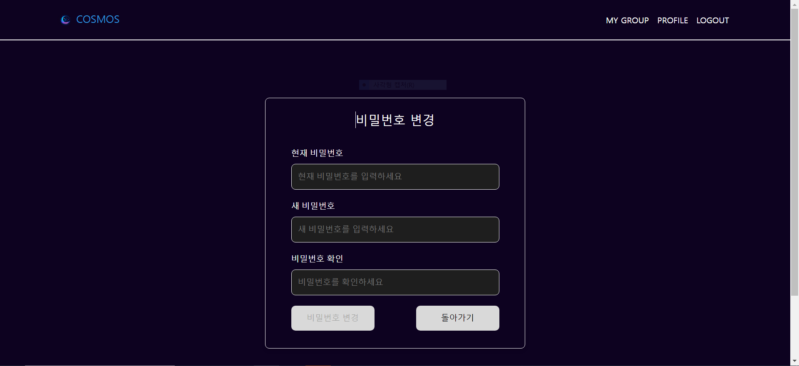

`# COSMOS - 화상 회의를 이용한 코딩 스터디 최적화 프로젝트

## 목차

### 1. [프로젝트 개요](#1-프로젝트-개요)

### 2. [기술 스택](#2-기술-스택)

### 3. [아키텍처 & ERD](#3-아키텍처--erd)

### 4. [서비스 기능 소개](#4-서비스-기능-소개)

## 1. 프로젝트 개요

[COSMOS](https://i11a708.p.ssafy.io/)는 개발된 코딩 스터디 맞춤형 서비스를 제공하는 사이트입니다.

### 📅 개발 기간

| 개발기간 | 2024.07.05 ~ 2024.08.16 (6주) |
| -------- | ----------------------------- |

### 👥 팀원 소개

| 팀원   | 역할      | 개발 내용                                                                       |
| ------ | --------- | ------------------------------------------------------------------------------- |
| 김도한 | 팀장, BE  | DB설계, 화상 회의, 문제 불러오기(Baekjoon, github 크롤링) , 프로젝트 관리(Jira) |
| 정예은 | BE 리드   | DB설계, 유저 인증 기능(E-mail, 소셜), 폴더 및 페이지 관리                       |
| 곽지혁 | BE, Infra | DB설계, 인프라 구축(Proxy서버, ci/cd), 코드 실행, 그룹 및 폴더 관리, 화상 회의  |
| 정호성 | FE 리드   | 그룹관련 페이지 UI(폴더구조, 사이드바, 템플릿 제작), 코드 실행 및 저장          |
| 김효준 | FE        | 로그인, 회원가입(+소셜), 유저 관리, 그룹 초대                                   |
| 지경근 | FE        | 화상회의, 공유편집기, 채팅                                                      |

### 💡 기획 의도

다음과 같은 문제 상황들을 개선하고자 했습니다.

1. 화상회의를 진행하는 과정이 번거로워 효율적인 소통이 어려운 점.
2. 구두로 설명하기 어려운 코딩 테스트 문제의 난해함.
3. 기록 관리가 까다로워 체계적인 업무 처리가 어려운 점.

## 2. 기술 스택

  Infra
  

    
    
    
    
  

  BE & DB
  

     
    
    
    
  

  FE
  

    
    
    
    
  

  ETC
  

    
    
  

## 3. 아키텍처 & ERD

## 4. 서비스 기능 소개

1. 유저 관리 기능

   - 일반 계정(E-mail), 소셜계정(kakao, naver)를 통한 유저관리
   - 로그인, 로그아웃, 회원가입, 회원탈퇴, 프로필 수정, 비밀번호 변경 등
     

     
관련 화면

     <li>
로그인 화면
</li>
     
     
일반 로그인, 네이버 로그인, 카카오 로그인

     <li>
회원가입 화면
</li>
     
     
이메일 인증 후,  일반 회원가입, 네이버 회원가입, 카카오 회원가입

     <li>
비밀번호 찾기 화면
</li>
     
     
이메일 인증 후, 비밀번호 변경

     <li>
비밀번호 변경 화면
</li>
     
     
기존 비밀번호 입력 후, 비밀번호 변경

     <li>
유저정보 화면
</li>
     
     
가입 정보와 이메일, 닉네임, 자기소개, Git Repo Branch 정보

     <li>
유저정보 변경 화면
</li>
     
     
가입 정보와 이메일, 닉네임, 자기소개, Git Repo Branch 정보 변경

     

2. 그룹 관련 기능
   - 그룹 초대, 참여, 탈퇴 기능(E-mail, 참여 코드)
   - 그룹 내부 일정을 관리할 수 있는 기능
   - 그룹원의 제출 여부와, 풀이를 확인할 수 있는 기능
     

     
관련 화면

     
     <li>그룹 메인 페이지 : 일정관리 및 그룹 정보, 화상회의 시작</li>
     
     <li>그룹 설정 : 그룹 초대 코드, 그룹 정보 변경 및 탈퇴</li>
     
     <li>그룹 초대 : 이메일, 닉네임 초대</li>
     
     <li>그룹 개요 : 지금까지의 문제 풀이 목록, 스터디 생성</li>
     
     <li>스터디 개요 : 문제 추가 및 내 풀이 불러오기, 코드 페이지 및 문제 페이지, 스터디원의 풀이 현황</li>
     
     <li>개별 코드 : 풀이 코드 확인 및 코드 실행, 코드 편집</li>
     

3. 코드 관련 기능
   - 지정한 Github의 Repository에서 코드를 불러올 수 있는 기능
   - 사이트 내부에서 IDE처럼 편집을 하고 코드를 실행할 수 있는 기능
     

     
관련 화면

     
     

4. 화상회의 관련 기능
   - 내가 풀었던 코드를 불러오고 실행할 수 있는 기능
   - 코드를 공유하고 동시 편집할 수 있는 기능
   - 공유 그림판 사용 기능
   - 실시간 채팅 기능
   - 화면공유기능
   - 화상회의 기본적인 기능
     

     
관련 화면

     <li>공유 편집기, 공유 그림판, 화상 회의</li>
     
     <li>내 코드 페이지, 컴파일, 채팅</li>
     
     

`
